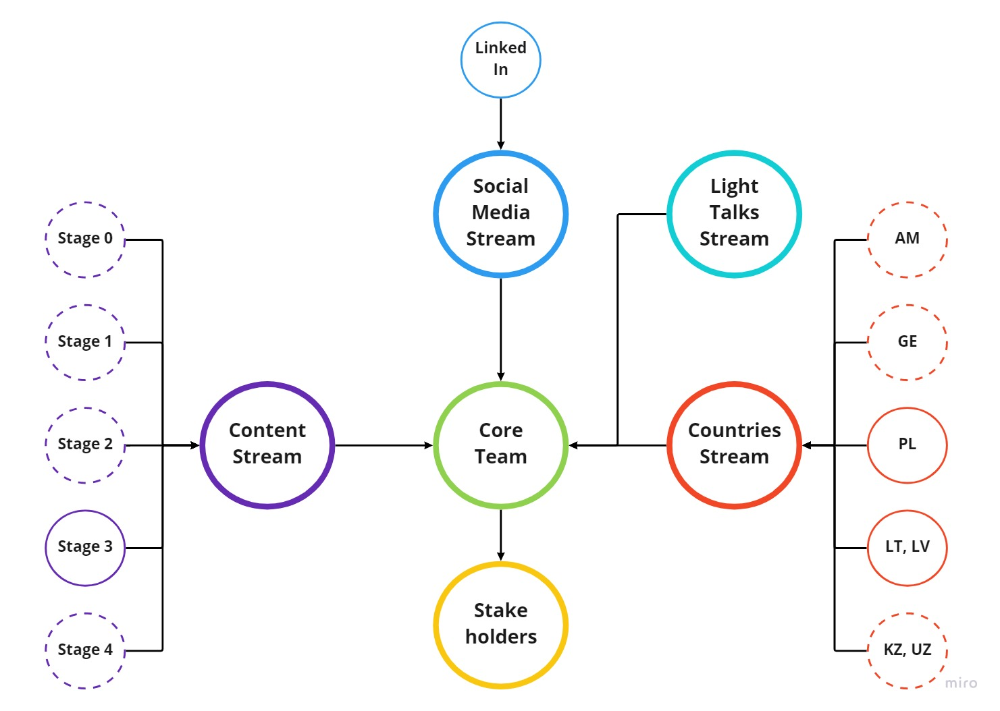

# Structure

As we grow, we face more and more challenges. Well-defined streams and structure is designed to help us to overcome these issues.

## Core Team
Core Team is a keystone to drive our school. It helps us to start new initiatives, identify gaps and resolve them.

### Responsibilities
* Starting and coordination of new initiatives within the School
  * Events planning and promotion
  * Starting and driving new streams
* Planning for School activities
* Retrospectives
* Decision-making for disputes
* Interaction with stakeholders
  * Communication and interaction with RD
  * Communication and interaction with Production
  * MJC as a main community
  * Other stakeholders

### How To Join?
Be a key member in one of other teams and wait for invitation to join.

### Drivers
* Oleg Zheleznov
* Sviatlana Zakharenka
* Maryia Zharykava
* Danila Varatyntsev
* Aliaksei Yermachonak
* Yana Bahdanovich
* Mikalai Karamach

## Content Stream
Content stream is a set of teams which helps us to keep our content up-to-date, create new study materials and support students. 
Each team is meant to be in charge of specific stage.

### Responsibilities
Responsibilities are listed for each team within this stream.
* Keep the content up-to-date
  * Update study materials to contain actual links
  * Resolve issues found by students, mentors, experts, etc.
  * Apply production experience to study materials to make sure content fits production needs.
  * Keep AutoCode programs up-to-date
* Create new study materials
  * Cover gaps in our materials
* Support students in our chats

### Roles
* **Content Creator** - a person who is dealing with content creation & updates, AutoCode maintenance. Stage Coordinator role might be used by mature Software Engineers or Senior Software Engineers as a good starting point to grow as a leader. It is also a great chance to learn something new or recap already gain knowledge.
* **Stage Driver** - a person who drives the whole stage, helps to resolve impediments. De-facto a scrum master for other team members. Content Creator role is a good role for volunteers who are mature engineers and would like to make their ideas come true. Content creation is not only about some study materials, this could also be some videos, etc. **This is one of two starting points to join the school for the majority of engineers**.
* **Expert** - a person who supports students in chats or via various events and communication channels, helps to keep AutoCode up-to-date. The last, but not the least is a very important role of Expert - this is a good chance to join the school for less mature engineers with production experience. This is a great option if you'd like to promote your mentoring and knowledge sharing skills to a new level.

### How To Join?
In general, please reach out to corresponding stage coordinator.
Reach out to someone from core team if you'd like to become a stage coordinator.

### Drivers
* Stage 0 - Mikalai Karamach
* Stage 1 - Vacant
* Stage 2 - Vacant
* Stage 3 - Yana Bahdanovich
* Stage 4 - Maryia Zharykava

## Social Media Stream
If you're keen on social medias - this is a right place for you. This stream helps the School to promote us and our values in social medias.

### Responsibilities
Responsibilities are listed for each team within this tream.
* Continuously create and implement content plan
  * Regular posting in a given social media
  * Create a content plan
  * Create content for posts
* Moderate social media

### How to join?
No specific requirements here, if you're keen on this stream and creative - you're welcome. Reach out to someone from respective media team or Oleg Zheleznov.

### Drivers
* LinkedIn - Iryna Kastsevich, Helen Gridina, Aliona Markava

## Light Talks Stream
If you'd like to be a public speaker this is a great option. We have a concept of "Light Talks" - small lecture on some topic which covers one of the modules from our stages or goes beyond and covers some corner cases, life-hacks, etc.

### Responsibilities
* Host light talks event
* Create content for light talks

### How To Join?
Please, reach out to Danila Varatyntsev, who is a driver of Light Talks Stream. We suppose that a public speaker should be a mature Software Engineer or Senior Software Engineer and higher.

### Driver
Danila Varatyntsev

## Countries Stream
Nevertheless, we respect no borders, we still need a specific stream for each country to organize mentoring on advanced stages, help both students and RD.

### Responsibilities
* Interact with RD to coordinate on possible demand and mentors
* Interact with students in order to get them into possible staffing
* Mentoring organization and running
  * Keep "mentors handbook" up-to-date

### Roles
* **Country Driver** - a keystone person who is represents school for both students and RD. Should be at least a Senior Software Engineer with a focus on leadership.
* **Run Coordinator** - a person who drives the specific mentoring run, helps mentors and students, helps in staffing process. Should be at least a Senior Software Engineer with a focus on leadership.
* **Mentor** - a person who communicates with student on a daily basis, shares knowledge, help students to meet timelines, performs code-review and handles demo-sessions. **This is a great opportunity to join the school for the majority of engineers**.

### How To Join?
In order to become a run coordinator or mentor please reach out to respective country driver. No strict way to become a country driver is offered. If you're interested, please reach out to Oleg Zheleznov.

### Drivers
* PL - Aliaksei Yermachonak
* LT, LV - Danila Varatyntsev
* GE, AM, UZ, KZ - Vacant

## Roasting Stream
We would like to kick off a format of roasting battles among students, so if you're interested in such a format, you're welcome to join.

### Responsibilities
We consider creating a similar structure for Roasting Stream as we have for Content Stream.
* Regularly host roasting session
* Prepare questions for sessions
* Provide feedback to students

### Roles
* **Driver** - a keystone person who organizes the whole team. De-facto a scrum master for a small team of engineers.
* **Roaster** - a person who is very similar to mentors except they do not answer questions, they ask.

### How To Join?
Since we do not have a clear format established, please reach out to anyone from Core Team if you'd like to participate.

## Stakeholders
We identify three main stakeholders for our School:
* **Resource Development** - EPAM department which is responsible for students' education. We serve them as a black-box service which helps with education process realization. At the same time, RD helps us with administrative stuff and offers possible employment options for students. 
* **Production** - EPAM projects and departments. We serve them as a source of new engineers who fits their demand. At the same time they help us with promotion to attract new contributors.
* **MJC** - a main community. We serve them as a source of new community members. At the same time they serve us as a source of contributors. However, it is incorrect to say that MJC School and MJC are two different entities. We're both partsof a big common community.